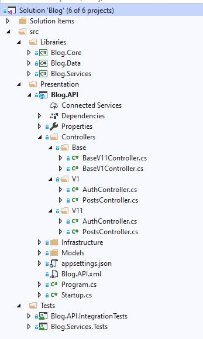
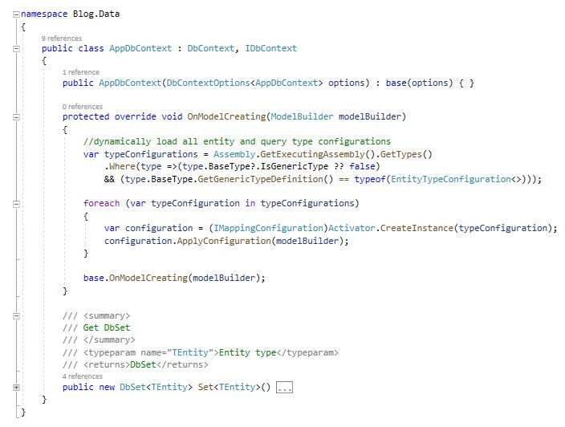
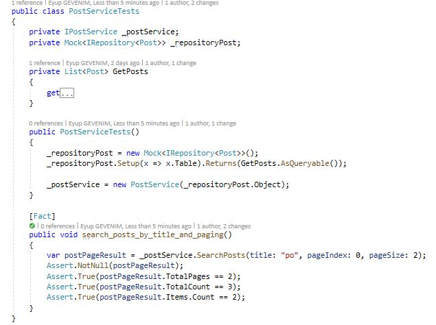

.Net Core 3.0 Web API Design
============================

.Net Core 3.0 Web Api design versioning, Jwt bearer authentication, swagger documentation, serilog logger,
 EF Core Repository pattern, Db Migration, NUnit Tests, dependency injection and project layers  


 Project layers
 --------------





Web Api versioning
 -----------------
v1.0
<br />

<br />

 v1.1
<br />

 
Jwt bearer authentication
-------------------------


Swagger documentation
---------------------


Migration
---------
go ```.....\Blog\src\Libraries\Blog.Data ``` path
open CLI and run commands
```
#restore Blog.Data project
...Blog.Data_> dotnet restore

#build Blog.Data project
...Blog.Data_> dotnet build

#add Initial name migrations 
...Blog.Data_> dotnet ef migrations add Initial

#Update migrations on database
...Blog.Data_> dotnet ef database update
#dotnet ef database update Initial

```

EF Core Repository
------------------

mapping
<br />
 
<br />

DbContext
<br />

<br />

Generic repository
<br />

<br />

Dependency injection
<br />


NUnit Tests
-----------




Serilog Logger
-----------

